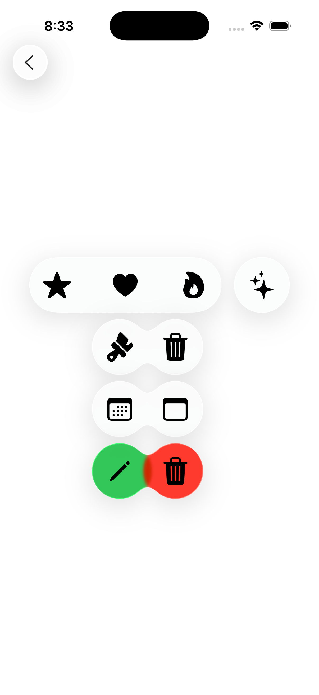

# 🧊 LiquidGlassExamplesApp

An iOS 26+ SwiftUI demo showcasing the new **Liquid Glass** design system introduced by Apple.

This app demonstrates how to use `glassEffect(...)`, `GlassEffectContainer`, and related APIs to create responsive, immersive, and elegant UI components that feel like layered glass.

## 📱 Features

### 🔹 `GlassView.swift`
Explore the different styles of `.glassEffect(...)`:

- ✅ **Basic Glass** — applies system default appearance
- ✅ **Custom Shape Glass** — uses `.rect(cornerRadius:)`
- ✅ **Interactive & Tinted Glass** — responds to user interaction with color and light

All views are placed over a vibrant gradient background so the glass effect is clearly visible.

---

### 🔹 `GlassContainersView.swift`
Learn how to group and coordinate glass elements using:

- `GlassEffectContainer`: organizes and renders multiple glass views cohesively
- `glassEffectUnion(...)`: creates seamless groupings within a shared container
- `.tint(...)` and `.interactive()` for expressive, lively feedback

This view includes:
- Icon clusters grouped into multiple containers
- Offset elements to show parallax and interaction
- Colored and animated glass buttons

---

## 🚀 Requirements

- Xcode 26 or later
- iOS 26+ device (or compatible simulator)

> ℹ️ Liquid Glass is only available on iOS 26+, and best experienced on a real device for motion effects and blur rendering.

---

## 🧪 Getting Started

1. Clone this repository.
2. Open `LiquidGlassExamplesApp.xcodeproj` in Xcode.
3. Run on a simulator or iOS 26+ device.

---

## ✨ Screenshots

| `GlassView` | `GlassContainersView` |
|-------------|------------------------|
|  |  |

---

## 📚 Related Reading

- [Apple Developer Documentation – `glassEffect(...)`](https://developer.apple.com/documentation/swiftui/view/glasseffect(_:in:isEnabled:))
- WWDC 2024 Session: *“Designing Interfaces with Liquid Glass”*

---

## 💡 Inspiration

This project was inspired by Apple’s new visual language in iOS 26, designed to create more immersive, layered, and expressive experiences — with a native SwiftUI implementation.

---

Enjoy building shiny, beautiful apps! ✨
